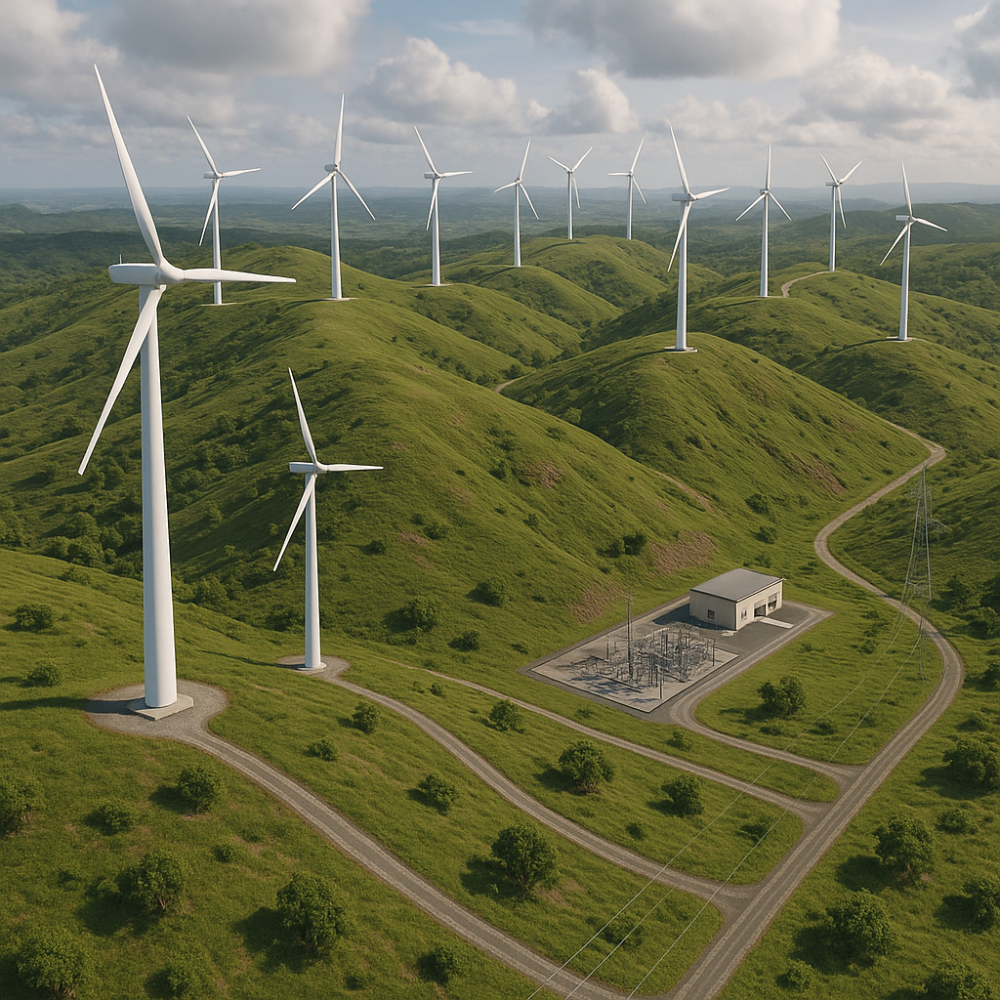
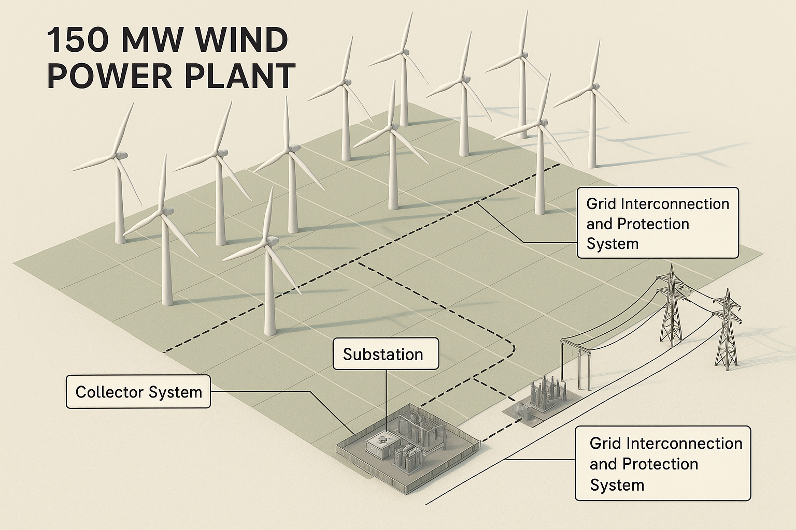
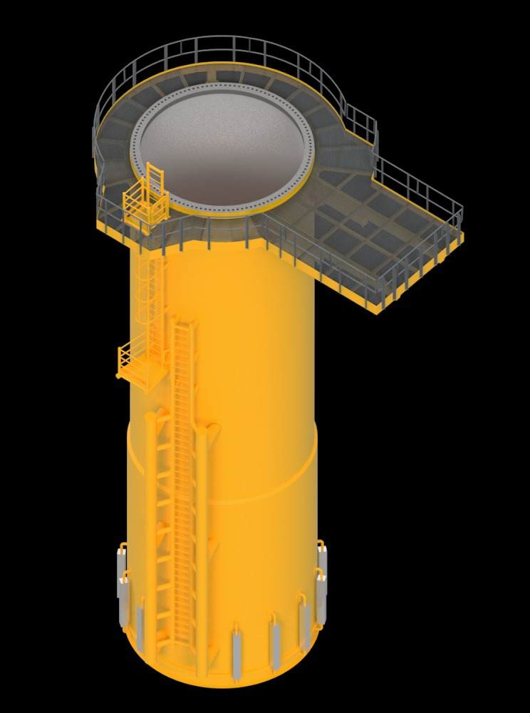
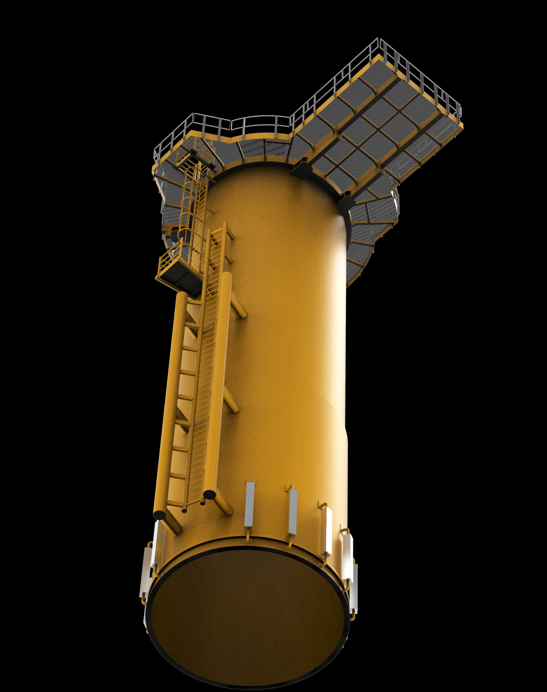

# 150 MW Wind Farm Design



---

# Overview

This project presents the conceptual design and engineering analysis of a **150 MW utility-scale onshore wind farm**. The objective was to develop a technically feasible and economically viable renewable energy project by integrating wind resource assessment, turbine selection, electrical system design, AutoCAD layouts, MATLAB analysis, and financial evaluation.

The project demonstrates the engineering workflow involved in planning a modern wind power plant, from preliminary design through system analysis and documentation.

---

# Project Objectives

- Design a utility-scale 150 MW wind farm.
- Evaluate the technical feasibility of the proposed installation.
- Perform wind resource and power generation analysis.
- Develop electrical layouts and supporting engineering drawings.
- Assess the project's economic viability.
- Produce complete technical documentation for the proposed design.

---

# Project Specifications

| Parameter | Value |
|-----------|-------|
| Installed Capacity | 150 MW |
| Energy Source | Onshore Wind |
| Wind Turbine Type | Horizontal Axis Wind Turbine (HAWT) |
| System Components | Wind Turbines, Collection Network, Substation, Transmission Connection |
| Design Software | AutoCAD, MATLAB |

---

# Design Methodology

The project followed a structured engineering design process consisting of:

1. Wind resource assessment
2. Wind turbine selection
3. Wind farm layout planning
4. Electrical network design
5. Substation planning
6. MATLAB performance analysis
7. Financial evaluation
8. Technical documentation

---

# AutoCAD Design

The repository includes AutoCAD drawings developed during the design process, including:

- Wind turbine components
- Turbine assembly
- Tower design
- Substation layout
- Wind farm arrangement
- Supporting mechanical drawings

---

# MATLAB Analysis

MATLAB was used to perform engineering calculations and evaluate system characteristics, supporting design verification and performance assessment.

Included MATLAB file:

- `wind_turbine_output_characteristics.m`

---

# Financial Evaluation

The project includes a high-level economic assessment considering:

- Estimated project cost
- Energy production
- Revenue estimation
- Investment feasibility
- Overall project viability

---

# Project Gallery

## Wind Farm Layout


---

## Substation Layout



---

## Tower Design



---

## Tower Bottom View



---

# Repository Contents

```text
150MW-Wind-Farm-Design
│
├── AutoCAD Design/
│   ├── AutoCAD drawings
│   ├── Turbine components
│   ├── Tower design
│   └── Substation design
│
├── Images/
│
├── DESIGN OF A 150MW WIND FARM.pdf
├── DESIGN OF A 150MW WIND FARM.pptx
├── wind_turbine_output_characteristics.m
├── power_unit_1.dwg
└── README.md
```

---

# Software & Tools

- AutoCAD
- MATLAB
- Microsoft PowerPoint
- Microsoft Word

---

# Key Learning Outcomes

This project demonstrates experience in:

- Wind Energy Engineering
- Renewable Energy Systems
- Power System Planning
- Utility-Scale Project Design
- AutoCAD Engineering Design
- MATLAB Engineering Analysis
- Technical Documentation
- Engineering Feasibility Studies

---

# Future Improvements

Possible extensions of this project include:

- Detailed load flow analysis
- Power system protection coordination
- ETAP-based network studies
- SCADA system integration
- Grid stability assessment
- Environmental impact modelling

---

# Author

**Davin Madegwa**

Bachelor of Science in Electrical & Electronic Engineering

University of Nairobi

---

*This repository showcases an academic engineering design project focused on the planning, analysis, and documentation of a utility-scale onshore wind farm.*
